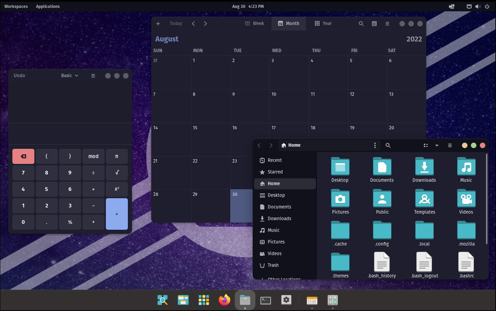
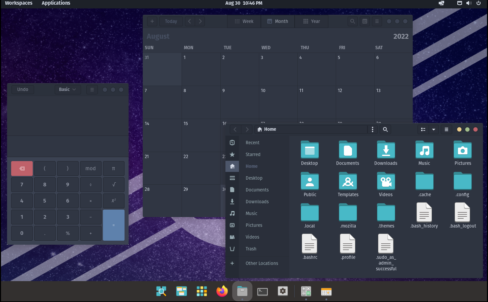
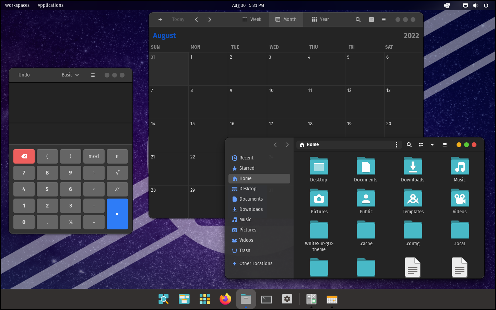
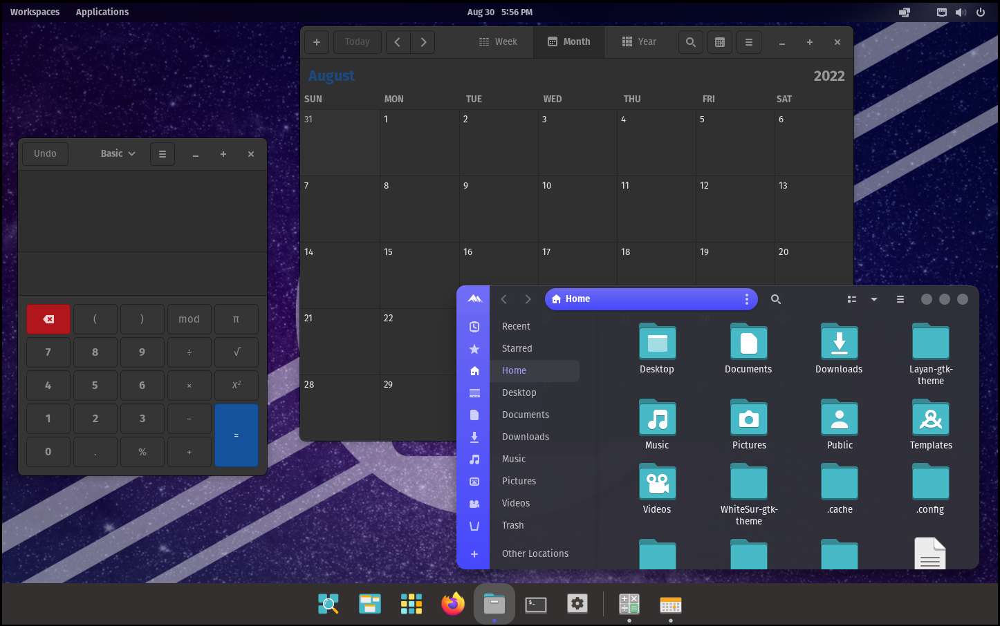
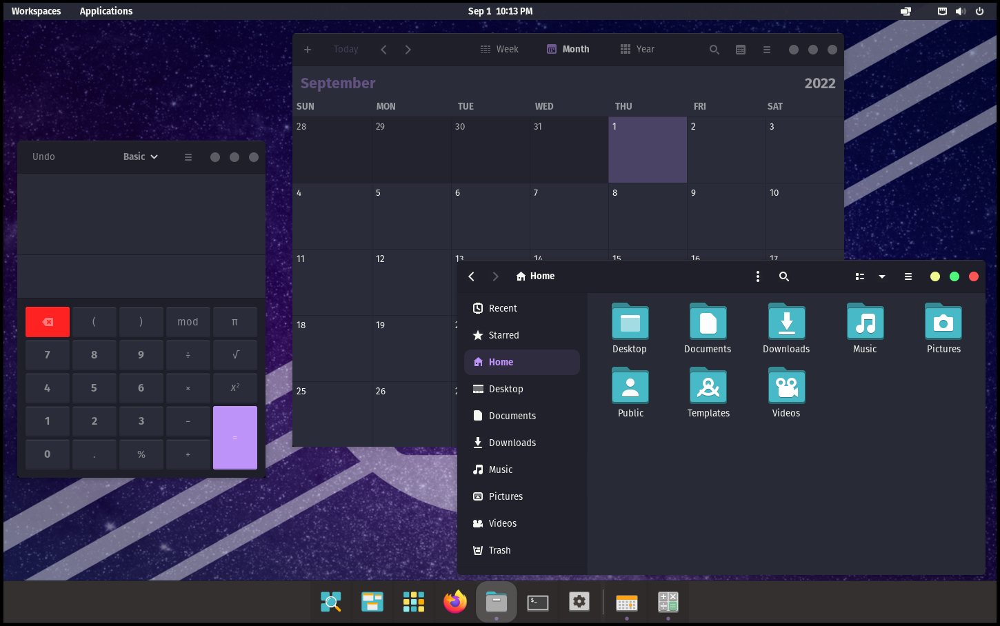
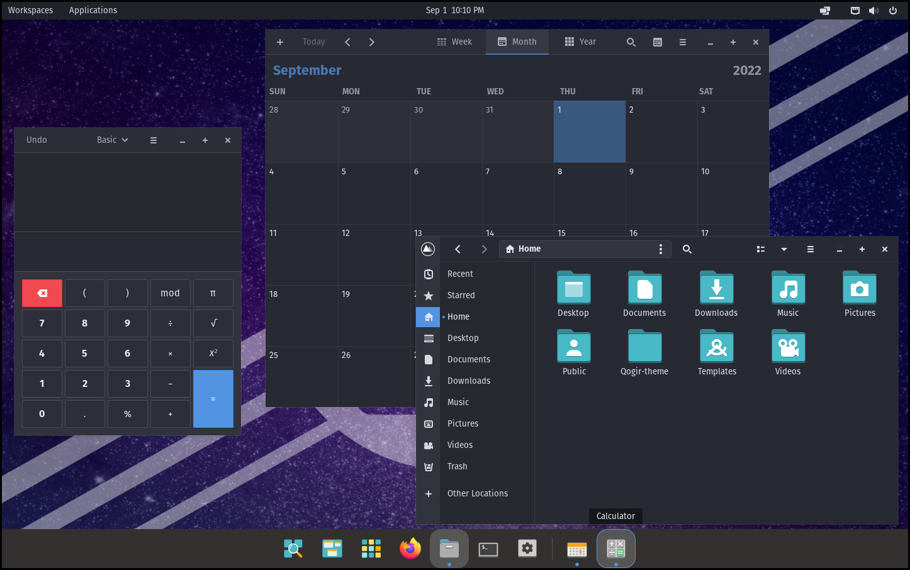

# Top 10 Best GTK Themes

Good evening, wonderful internet people; we’re back yet again with the best GTK themes to spice up your desktop because imagine using default themes in 2022. We are using stock Pop!_OS in the screenshots to display the theme, although you can do much more customization yourself if you so desire. Let’s get right into it!

<!-- truncate -->

## 1. Catppuccin

Catppuccin Mocha (no colour) Version

This one is for you for all those cafe-loving cat (or cat cafe) people out there! Unless, of course, you’re into espressos rather than cappuccinos.

There are many, many options and colours in the GitHub Releases; check them out for yourself!

If you really like this colour scheme, you can use it for [a lot more](https://github.com/catppuccin/catppuccin) than just your desktop.

[GitHub - catppuccin/gtk: 🪟 Soothing pastel theme for GTK3](https://github.com/catppuccin/gtk)

## 2. Nordic

Nordic Darker Version

For all the Viking and Norse mythology fans, here is the Nordic theme (Nordic doesn’t mean Norse, by the way).

Overall, it’s an excellent theme for those who like winter!

[GitHub - EliverLara/Nordic: Dark Gtk3.20+ theme created using the awesome Nord color pallete.](https://github.com/EliverLara/Nordic)

## 3. WhiteSur

WhiteSur Dark Version

As you can tell, this theme was inspired by macOS. That’s right, we took the light theme and made it dark. That’s how much we hate light mode! 

Anyways, the WhiteSur repository has more than just a GTK theme. You can go as far as making your GNOME desktop environment look exactly like macOS! It even has its own [icon pack](https://github.com/vinceliuice/WhiteSur-icon-theme) (which looks extremely clean).

[GitHub - vinceliuice/WhiteSur-gtk-theme: MacOS Big Sur like theme for Gnome desktops](https://github.com/vinceliuice/WhiteSur-gtk-theme)

## 4. Layan

Layan Dark Version

The Nautilus sidebar looks very cool, although besides that, it’s not much.

[GitHub - vinceliuice/Layan-gtk-theme: Layan-gtk-theme](https://github.com/vinceliuice/Layan-gtk-theme)

## 5. Gruvbox

Gruvbox Dark with Borders

My favourite theme, with the slight orange hints and a warm colour palette, leaves me feeling chill and warm during those late-night study sessions. 🔥

[Gruvbox GTK Theme](https://www.pling.com/p/1681313/)

## 6. Graphite

Graphite Dark Black Version

Good stuff, now you won’t blind yourself looking at your file manager… except for the sidebar, it’s pretty bright.

There are many variants (like Nord) to this theme too; it’s worth checking out!

[GitHub - vinceliuice/Graphite-gtk-theme: Graphite gtk theme](https://github.com/vinceliuice/Graphite-gtk-theme)

## 7. Juno

Juno Standard Version

Damn, that looks nice; I like the colour palette. It gives an ocean vibe. There are quite a few variants too.

[Juno](https://www.gnome-look.org/p/1280977)

Notice: The theme does have a few flaws that I experienced and are summed up well by the [open issue](https://github.com/EliverLara/Juno/issues/51) on the themes’ GitHub page.

## 8. Dracula

Dracula Standard Version

Dayum, this thing has a GTK theme too. I see it almost everywhere, from Obsidian to VS code. I hope it keeps growing!

[Dracula](https://www.gnome-look.org/s/Gnome/p/1687249)

## 9. Orchis

Orchis Standard Version

That orange backspace button hits hard…

Otherwise, it’s a pretty solid theme with a few variants/tweaks you can use to customize it further.

[GitHub - vinceliuice/Orchis-theme: Orchis is a [Material Design](https://material.io) theme for GNOME/GTK based desktop environments.](https://github.com/vinceliuice/Orchis-theme)

## 10. Qogir

Quogir Dark Version

Finally, I get to go home; this theme looks kind of meh.

The Nautilus sidebar looks cool, but the theme is a bit square and dull. However, you can change the windows buttons to be similar to the ones on Windows if that’s what you want.

[GitHub - vinceliuice/Qogir-theme: Qogir is a flat Design theme for GTK](https://github.com/vinceliuice/Qogir-theme)

### We don’t hate light mode, by the way. 😂

> We hope you like our rants and if you enjoy our content, consider subscribing…. No, we don’t have any Patreon or anything, so check out our other pages instead!
>